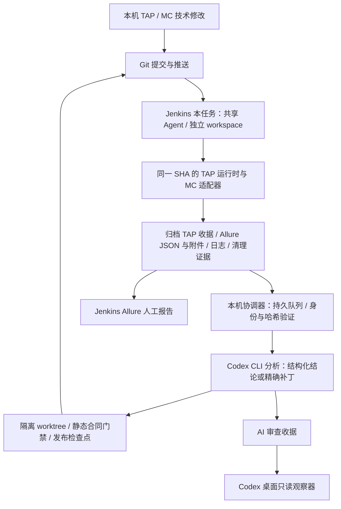

# 商品中心后台闭环

## 当前架构



**必须：单一协调器。目的：**避免桌面和后台重复修复、重复推送。**预期结果：**关闭 Codex 桌面后仍可发现构建并分析；重新打开后读取同一状态。**后续影响：**维护一个本机 Windows 计划任务；已有业务通过收据不变。

Windows 任务名 `Menusifu-ProductCenter-AI-Worker`，脚本 `ci/worker.ps1 serve`，当前模式 `repair`。采用当前 Windows 用户登录会话运行，以便读取 DPAPI 凭据和 Codex 登录。锁屏及关闭 Codex 窗口支持；机器休眠、关机、用户注销时不执行，重新登录后补查。AI 提供商沿用本机 Codex 配置；当前代理是独立运行的 CC Switch，它也须保持可用。未实际关闭用户正在使用的 Codex 窗口来验收。

**可选：常驻服务账号或外部服务机。目的：**支持用户注销期间运行。**预期结果：**与当前登录会话解耦。**后续影响：**需要独立维护身份、网络与 AI 凭据，本次未部署；不重跑业务。当前需求无需这项能力。

## 触发与恢复

- 无待办时每 120 秒只查 Jenkins 元数据；发现正在运行的构建后每 30 秒查询。查询不是 AI 调用。
- 只有待审查构建才启动 CLI。按 server/job/build 唯一入队；同 SHA 重跑是不同构建，重复通知是同一待办。
- Windows 每分钟监督唯一进程，登录自动启动。进程文件锁、SQLite 队列代次与租约共同约束所有者；重启后恢复未完成阶段。
- AI 子进程加入 Windows Job Object；协调器退出时只终止本次拥有的子进程树。
- Git 推送和 HTTP GET 有界重试；构建 POST 保存 request ID 后先对账再恢复，不能盲目重放。
- 已下载不等于已分析；`analysis.json` 为传输校验，`ai-review.json` 为真实 AI 结论。后续验证必须绑定精确提交、请求和范围。
- 代码冲突、网络中断、模型超时保留检查点和脱敏诊断。只有业务正式来源冲突进入业务裁决；不把技术故障算成产品缺陷。

**暂不建议：现在新增 Jenkins 回调服务。目的：**避免额外监听端口及公司网络改动。**预期结果：**先用已验证的分页补查保证可靠发现。**后续影响：**完成发现通常延迟约 30–120 秒，另加下载和 AI 时间；没有新业务重跑。以后可接回调作为唤醒提示，仍保留补查和去重。

## Allure 与 AI 的证据

沿用 MC 已有 Allure reporter 和已安装的 Jenkins Allure 工具，没有安装插件或修改 Jenkins 全局配置。人工访问构建的 `allure/`；AI 消费原始 Allure JSON、断言附件及 TAP 标准收据，HTML 仅用于阅读。

报告附件路径与完整性、逐文件大小和 SHA256、构建身份、选择集、标准收据分别校验。MC 仅映射 case ID，公共 TAP 校验遗漏/重复/额外用例和无收据通过。缺附件、证据不完整或 Allure/TAP 结论冲突会保留失败审计，不能只凭绿色报告接受。

已验收真实业务基线：Build 34，10 通过 / 0 失败 / 0 跳过，严格断言收据完整。Build 35 是 Allure 管道验收：64 基础合同通过 / 1 原有条件跳过，加 1 个明确标注的非业务报告样本；后台已自动写入 AI 审查收据。当前优化只做报告与合同验证，不重复执行那十条业务。

最终优化验收：Build 36，提交 `bdda5bf1ba5fe63b3ffd338d848d1a20d29b6f81`，Jenkins SUCCESS；64 基础合同通过 / 0 失败 / 1 原有条件跳过，新增 17 项 CI 合同全部通过，1 个 Allure 非业务样本通过。后台自动发现运行、下载并核验 26 份归档、调用 AI 完成审查，`output/jenkins/build-36/ai-review.json` 已完成。另有本机 20 项 Python 合同通过；后台重启后已审查构建未重复分析。完整验收记录为 `output/worker/optimization-acceptance.json`。

商品中心仍只申请一个 Jenkins executor。业务阶段的 Playwright worker 上限由 MC 系统 manifest 声明为 7，并经过 TAP 公共并发决策按 CPU、内存和选择集数量自动裁剪；认证和预检阶段固定单 worker。当前十条试点由单 executor 内最多七个业务 worker 执行，收据、资源锁、运行 ID 和 Allure 结果仍按用例隔离。

最终 7 worker 验收：Build 38 使用提交 `6a09262052862a808dba0f2e20127eb9c2745add`，Jenkins SUCCESS；日志确认 `Running 10 tests using 7 workers`，公共并发收据确认 `configuredMaxWorkers=7`、`effectiveWorkers=7`，CPU 上限 9、内存上限 57，未发生降级。十条商品中心业务用例 10 通过 / 0 失败 / 0 跳过，Allure 原始结果 10 个均为 passed，后台 AI 已完成身份、收据、证据和清理审查，结论为无需修改源码。

独立样本 `output/worker-acceptance/acceptance.json` 证明真实 AI 对错误加法提出补丁、协调器应用、定向检查通过和重复补丁拒绝。队列、进程终止、断点恢复、身份、选择集、附件和发布后验证有系统无关负向测试。此样本不触发线上构建，也不冒充 MC 业务测试。

公共平台总门禁仍返回 `FINAL_GOAL_NOT_MET:PROJECT_ADAPTER_REQUIRED`；这是跨系统最终目标缺口，不是本次 MC 闭环失败，也不能被本次报告验证掩盖。

## 运维入口

在集成仓库根目录运行：

```powershell
./ci/worker.ps1 status
./ci/worker.ps1 pause
./ci/worker.ps1 resume
# 更新本任务的 Windows 启动配置（仅安装或维护时使用）
./ci/install-worker.ps1
```

`pause` 会阻止后续工作，并中断本 worker 拥有的活动子进程；进行手工维护前等状态显示 paused。`resume` 后按检查点继续，不恢复另一个执行者。停止或卸载仅针对上述 Windows 任务；不要动其他 Jenkins 任务。

状态 `output/worker/status.json`；持久队列 `output/worker/queue.sqlite`；发布检查点 `output/worker/build-N/publish-checkpoint.json`；构建结果及 AI 审查 `output/jenkins/build-N/`。这些均为本机忽略目录，不上传凭据或原始模型日志。

应用内 `jenkins-ai` 每五分钟只读观察并通知有意义的变化，不参与执行。关闭应用期间后台继续工作；重新打开后观察已有结果，不要求用户再发“获取 Jenkins 结果”。
